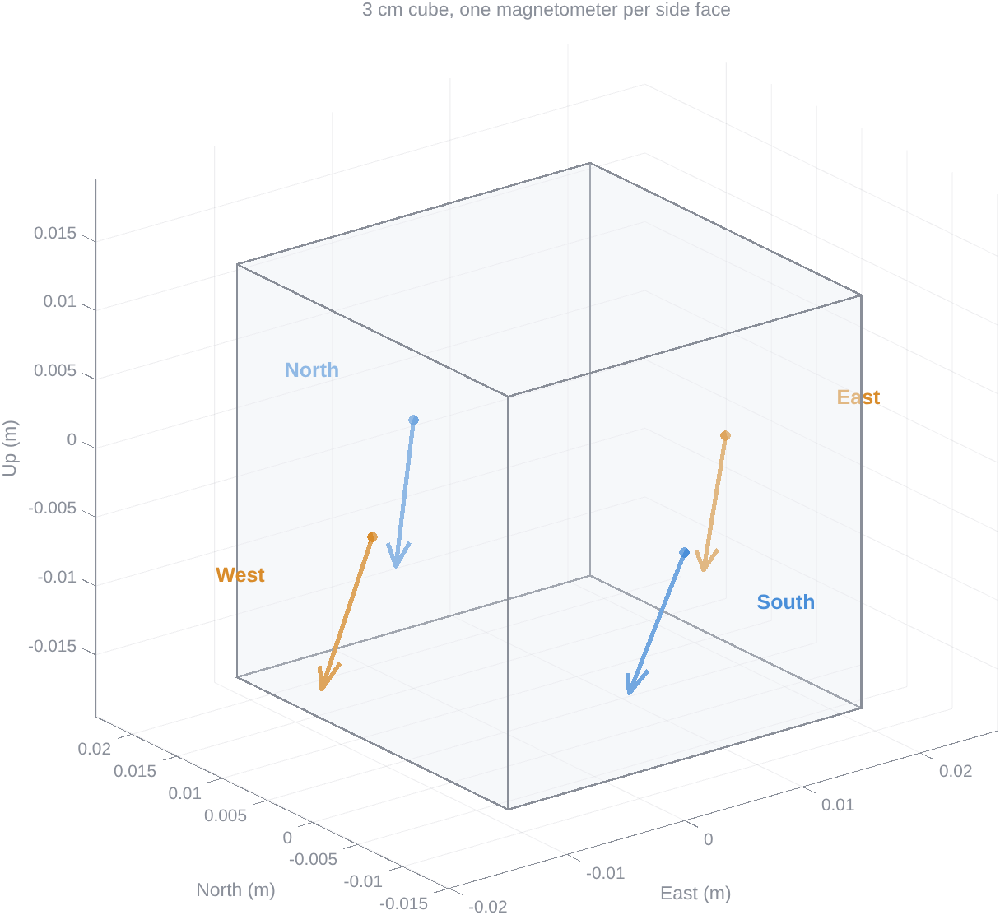
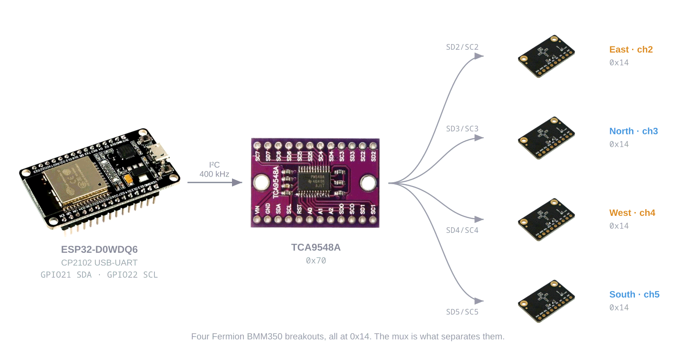

# Magnetic Gradient Cube

Four magnetometers on the side faces of a 3 cm cube, controlled by ESP32 through an I²C multiplexer to measure the gradient of the magnetic field.
Each face reads one field vector. East minus West gives the x column of the gradient tensor,
North minus South the y column.

A 3D view of the 3 cm cube with the magnetic field vector drawn on each of the four side faces, in world axes East, North and Up.



## Hardware
An ESP32 drives a TCA9548A multiplexer over I2C, which fans out to four BMM350 breakouts on channels 2 to 5, all sharing address 0x14.



ESP32-D0WDQ6, TCA9548A, 4 × Fermion [BMM350](https://wiki.dfrobot.com/SKU_SEN0622_Fermion_BMM350_Triple_Axis_Magnetometer_Sensor).
All four sensors sit at `0x14`; the mux is what separates them. Leave ADSEL alone.

### Wiring

| From | To |
|---|---|
| ESP32 `GPIO21`, `GPIO22` | TCA9548A `SDA`, `SCL` |
| ESP32 `3V3`, `GND` | TCA9548A `VIN`, `GND` |
| TCA9548A `RST` | `3V3` (active low) |
| TCA9548A `A0`–`A2` | `GND`, giving `0x70` |
| TCA9548A `SD2`–`SD5`, `SC2`–`SC5` | breakout `SDA`, `SCL` |
| `3V3` rail, `GND` | breakout `3V3`, `GND` (3.3 V only) |

The mux switches SDA and SCL only and supplies no pull-ups, so each channel is a separate bus
needing its own pair. Each Fermion carries one, so every channel has exactly one.

### Mounting

| Channel | Face | Outward normal |
|---|---|---|
| 2 | `East` | +X |
| 3 | `North` | +Y |
| 4 | `West` | −X |
| 5 | `South` | −Y |

Boards sit component side outward with the header at the bottom, which puts sensor +X at world
up, +Y right seen from outside, +Z inward. World frame is X=East, Y=North, Z=Up, encoded only
in `matlab/client/magRot.m`.

## Run it

```sh
pio run -t upload                # streaming firmware
pio device monitor | tee field.csv
pio run -e muxcheck -t upload    # bring-up diagnostic, opt-in
```

```matlab
addpath matlab/client
h = magOpen;            % finds the board itself
S = magRead(h, 250);    % latest 250 samples
F = magField(S);        % world-frame vectors and gradient
magClose(h)

magCube                 % live 3D cube, one field arrow per face
magLive                 % live 3x4 grid of component traces
```

`magField` returns `F.B` (4×3 per face, µT), `F.mean`, `F.dev`, and `F.gradX`, `F.gradY` in
µT/m. `magCube` also has a `Deviation` mode that subtracts the four-sensor mean, leaving the
part the gradient comes from. No port is hard-coded: `magOpen` probes USB serial ports for the
CSV header, on Windows, Linux and macOS.

### Sensor reference

| | |
|---|---|
| Range | ±2000 µT |
| Noise | 190 nT rms (X, Y), 450 nT rms (Z) |
| ODR | 25 Hz here, 8× averaging |
| I²C address | `0x14` (ADSEL low), `0x15` (high) |

[BMM350 datasheet](https://www.bosch-sensortec.com/media/boschsensortec/downloads/datasheets/bst-bmm350-ds001.pdf) ·
[SEN0622 wiki](https://wiki.dfrobot.com/SKU_SEN0622_Fermion_BMM350_Triple_Axis_Magnetometer_Sensor) ·
[TCA9548A](https://www.ti.com/lit/ds/symlink/tca9548a.pdf)

## License

MIT. See [LICENSE](LICENSE).
